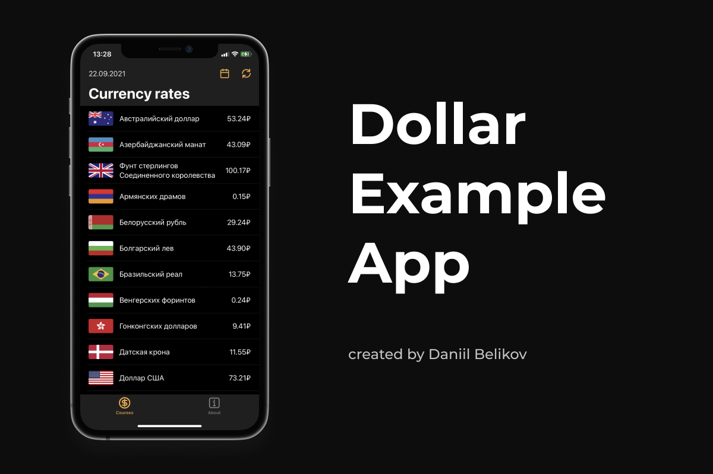

# Dollar App (SwiftUI code example)
Dollar is a simple app with current exchange rates from the Central Bank of Russia. This project was created to demonstrate the current level of programming skills in the SwiftUI framework.

Technology Stack: Xcode, SwiftUI, MVVM, XML parsing.

Created by [@daniilbelikov](https://github.com/daniilbelikov).

# Preview:

